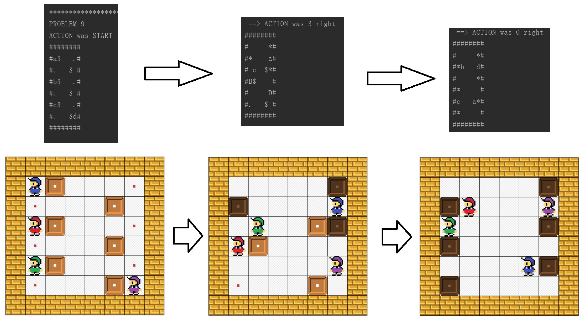

# sokoban-game-AI-solver

## Breif Introduction of the project
An individual project from the course "Introduction to Artificial Intelligence", developped a “Sokoban Game” AI solver with multiple searching algorithms (Depth First Search, Breadth First Search, Uniform Cost Search and Heuristic A* Search)

In this project the game rule is a little bit different from the classic Sokoban Game, there can be multible "workers" in the game.
  
The original game state can be input as a SokobanState object in sokoban.py, the following example is corresponding to the case shown in picture below:

```
SokobanState("START", 0, None, 6, 6, # dimensions
                 ((0, 0), (0, 2), (0, 4), (5, 5)), #robots
                 frozenset(((1, 0), (4, 1), (1, 2), (4, 3), (1, 4), (4, 5))), #boxes
                 frozenset(((5, 0), (0, 1), (5, 2), (0, 3), (5, 4), (0, 5))), #storage
                 frozenset() #obstacles
                 )
```

### Program solves for the solution and search for the final state


### For a detailed explanation please check "project_description.pdf"


